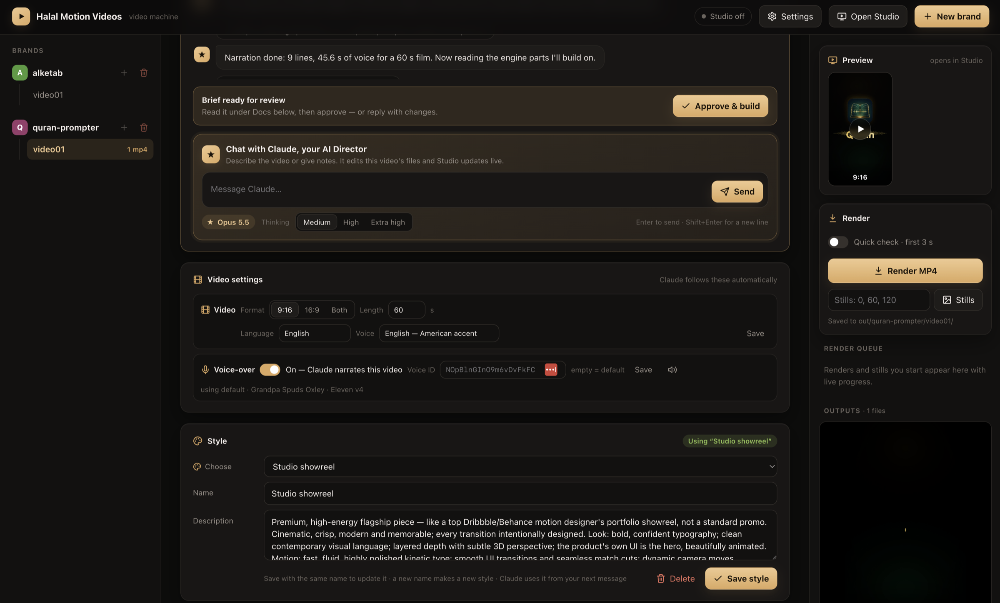

# Halal Motion Videos

A local machine for making motion-graphics videos — product promos, App Store previews, social clips — with [Remotion](https://www.remotion.dev).

Open the dashboard, describe the video, and a Claude-powered **Director** does the work:

- writes the brief, then waits for your approval before building
- captures **real screenshots** of your site or web app in a headless browser
- designs **sound effects by code** (no samples, no stock library)
- generates **voice-over** with ElevenLabs Eleven v4 (optional)
- builds the scenes in React, type-checks them, and checks its own frames

Every video belongs to a **brand** (an app or product), and one source renders every format: 9:16, 16:9, 1:1 and 4:5.



> [!WARNING]
> **Use this only to create halal videos.**
>
> Please don't use Halal Motion Videos for content that promotes or shows:
>
> - alcohol, drugs, gambling, or interest-based (riba) products
> - immodest, sexual or indecent content
> - mockery or disrespect of Allah, the Qur'an, the Prophets or Islam
> - lies, scams, misleading claims, or anything that harms people
> - hate, violence, or anything else that is haram
>
> If you're not sure whether something is halal, ask a knowledgeable scholar before you make it.

## Quick start

**On a Mac:** double-click **`Start.command`**.

- **First time:** it installs what it needs.
- **Then:** it starts the dashboard and opens it in your browser.
- **To stop:** close the Terminal window.

**From a terminal:**

```bash
git clone <this repo> && cd <this repo>
npm run setup      # installs what it can, tells you exactly what's missing
npm start          # → http://localhost:4000
```

### Requirements

| Needs | For |
| --- | --- |
| **Node.js 22+** | everything |
| **ffmpeg** (with ffprobe) | audio mastering, voice-over timing |
| **Python 3** | sound design (`setup` adds numpy + scipy in a `.venv`) |
| **[Claude Code](https://claude.com/claude-code) 2.1.280+**, set up and logged in | the Director chat (Opus 5.5) — everything else works without it |
| **ElevenLabs API key** | voice-over (optional; add it in the dashboard → Settings) |

`npm run setup` installs the npm packages, Remotion's headless Chrome and the Python packages. It never installs system software; for Node, ffmpeg, Python and Claude Code it prints the exact command instead. Run `npm run doctor` at any time, or open **Settings → System check** in the dashboard.

## Using it

1. **New brand** → name it after the app or product.
2. **Materials:** add the product's website, its source folder (read-only for Claude) and any logos, screenshots or fonts.
3. **Video settings:** format (9:16 / 16:9 / both), length, language, voice, and a **Style** from the shared library.
4. **Director:** say what the video is, e.g. "App Store promo that shows the main features". Approve the brief and it builds.
5. **Preview** in Remotion Studio, then **Render** MP4s to `out/<brand>/<video>/`.

## Command line

| Command | Does |
| --- | --- |
| `npm start` | the dashboard |
| `npm run new -- <brand> [video]` | new brand, or the next video in a brand |
| `npm run studio` | Remotion Studio |
| `npm run render -- <brand> [video] [format] [--frames=a-b]` | render MP4s (audio mastered to -16 LUFS) |
| `npm run shot -- <brand> [video]` | real screenshots from `shots.json` |
| `npm run sfx -- <brand> [video] [--look]` | design sounds from `sfx.json` |
| `npm run voice -- <brand> <video>` | ElevenLabs voice-over from `voiceover.json` |
| `npm run doctor` | system check |

## Where things live

| Path | What |
| --- | --- |
| `src/brands/<brand>/brand/` + `public/<brand>/brand/` | the brand kit: theme, fonts, logo, screenshots, signature sounds |
| `src/brands/<brand>/<video>/` + `public/<brand>/<video>/` | one video: brief, copy, timeline, scenes, sound, voice-over |
| `src/engine/` | shared building blocks (timing, layout, transitions, text, cards, sound) |
| `styles/library.json` | shared video styles |
| `out/<brand>/<video>/` | renders |
| `.director/` | local state: chats, settings and API keys, browser profiles (git-ignored) |

The full guide, which is also the Director's instructions, is in **[CLAUDE.md](CLAUDE.md)**.

**A fresh install has no brands.** Click **New brand** in the dashboard to make your first one. Your brands stay on your machine; `.gitignore` keeps them out of the repo.

## License

Source-available under the **[Halal Motion Videos License](LICENSE)**:

| Who | License |
| --- | --- |
| Individuals | Free, including commercial use |
| Companies with **up to 3 employees** | Free |
| Non-profits | Free |
| Evaluating (not yet commercial) | Free |
| Companies with **4+ employees** | Need a **Company License** — contact [CONTACT EMAIL OR URL] |

- **Your output is yours:** the videos you make belong to you.
- **Not allowed:** selling or reselling the software itself, or offering it as a hosted service.
- **Remotion** has its own, similar license. Larger companies need a [Remotion Company License](https://www.remotion.pro/license) as well.
- **Not covered:** the brands you create are yours; fonts and assets you add keep their own terms.

See [NOTICE.md](NOTICE.md) for the details.
